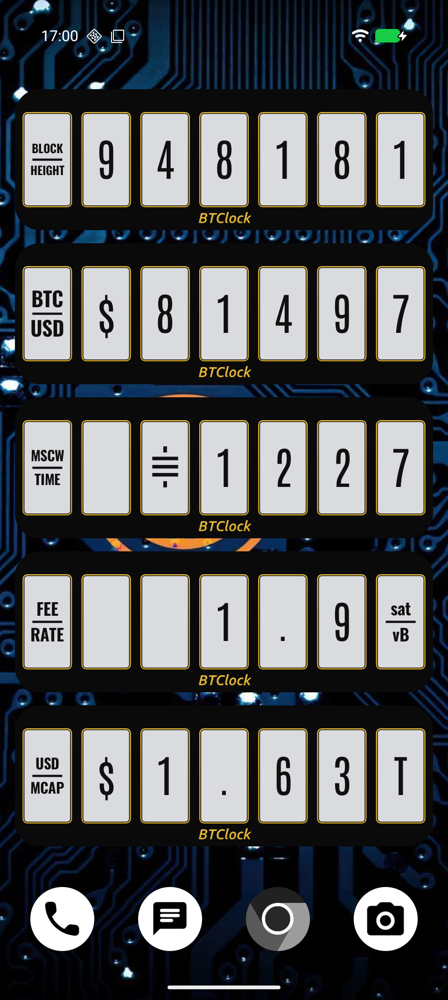
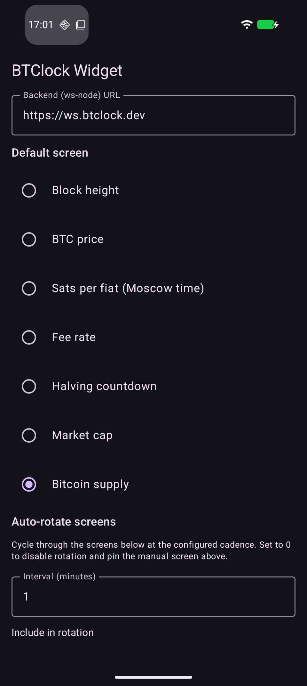

# BTClock Android home-screen widget

A Glance-based AppWidget that draws a [BTClock](https://btclock.dev/)
device on your home screen — gold ENIG silkscreen rings around
light-grey display panels on a black PCB, with the same screens the
hardware cycles through. Block height, BTC price, sats-per-fiat,
fee rate, halving countdown, market cap, and Bitcoin supply, all
rendered client-side with `android.graphics.Canvas` (no PNGs over
the wire, no WebView).

Talks to a [BTClock ws-node](https://git.btclock.dev/btclock/ws-nostr-publish-go),
defaulting to the public instance at `https://ws.btclock.dev` so the
widget works out-of-the-box without running anything yourself.

## Screenshots

| Home-screen widget | Settings activity |
|---|---|
|  |  |

## Features

- Seven on-device screens, modelled on the firmware's doc renders:
  block height, BTC price, Moscow time (sats-per-fiat), fee rate
  (with one decimal place), halving countdown, market cap, and BTC
  supply
- **Auto-rotation** between screens at a configurable interval
  (1 minute by default, 0 to disable). Each tick fetches fresh data
  before advancing
- **Tap to advance** — touching the widget steps to the next screen
  in the cycle and triggers a backend refresh, so you always see
  fresh data when cycling manually
- **Multi-currency** — pick from USD / EUR / GBP / JPY / CAD / AUD /
  CHF / CNY / INR / BRL / MXN / RUB / ZAR / SEK / NOK / DKK / PLN /
  TRY in the picker, or type any ISO code your ws-node exposes
- **Antonio / Oswald font picker** — both vendored from the firmware,
  switchable at runtime
- **Inverted palette** (white-on-black) toggle
- **Custom backend URL** for self-hosted ws-nodes; same widget code,
  point it at `http://your-host:8080` from the Settings activity

## Build

Standard Android Studio open. From the CLI:

```sh
# First time — generate the gradle wrapper jar (binary file we don't commit).
gradle wrapper --gradle-version 8.10.2

./gradlew assembleDebug
./gradlew installDebug
```

Requires JDK 17 and Android SDK with platform 35 + build-tools 35.x.
`minSdk = 26` (Android 8.0); adaptive icons and Glance both require
that floor.

## Configure

After installing, open the **BTClock Widget Settings** launcher icon,
or long-press the widget on your home screen → "Configure". The
configuration activity is also launched automatically the first
time you pin the widget.

| Setting | Default | What it controls |
|---|---|---|
| Backend URL | `https://ws.btclock.dev` | Where to fetch block / price / fee data |
| Default screen | Block height | Shown when auto-rotation is off and the rotation set has < 2 entries |
| Price currency | USD | Which entry of `/api/lastprice` to render |
| Auto-rotate interval | 1 minute | `0` disables; ≥ 1 advances through the rotation set on a timer |
| Include in rotation | All seven screens | Tick-list of screens the rotation cycle visits |
| Digit font | Antonio | Antonio (firmware default) or Oswald |
| Inverted | off | White-on-black panels |

Saves trigger an immediate one-shot refresh so you can verify your
URL works without waiting for the next periodic tick.

## How the refresh works

```
                              ┌─────────────────────────┐
WorkManager (15 min, NETWORK) │ AlarmManager (1 min,    │  Tap (Glance ActionCallback)
        │                     │ inexact set())          │         │
        │                     │         │               │         │
        ▼                     │         ▼               │         ▼
RefreshWorker.doWork()        │ RotationTickReceiver    │  AdvanceScreenAction
   (periodic safety net)      │ (advances all widgets)  │  (advances tapped widget)
        │                     │         │               │         │
        └─────────────────────┴─────────┴───────────────┴─────────┘
                                        │
                                        ▼
                           BackendRefresher.refreshNow()
                              ├─ Prefs.read()
                              ├─ BackendApi.fetchSnapshot(currency)
                              │     ├─ GET /api/lastblock
                              │     ├─ GET /api/lastprice  → pick currency
                              │     └─ GET /api/lastfee
                              └─ updateAppWidgetState(...)  ← per-widget Glance state
                                        │
                                        ▼
                              BTClockWidget.update(id)
                                        │
                                        ▼
                              FrameRenderer.render() → Bitmap
                                        │
                                        ▼
                              Glance Image(ImageProvider(bitmap))
                                        │
                                        ▼
                              RemoteViews → home-screen surface
```

Three converging refresh paths:

1. **WorkManager periodic 15-min tick** — battery-friendly safety
   net. Android's WorkManager refuses periodic work shorter than
   15 minutes, so this handles the long-tail "device idle for an
   hour" case.
2. **AlarmManager 1-min tick** — drives auto-rotation with sub-15-min
   cadence. Uses inexact `AlarmManager.set(RTC, …)` (no
   `SCHEDULE_EXACT_ALARM` permission needed) and re-arms itself on
   every tick. Each tick fetches fresh backend data **before**
   advancing the rotation index, so the newly-shown screen reflects
   the latest block / price / fee.
3. **Tap action** — Glance `ActionCallback` scoped to the tapped
   widget only; same fetch-then-advance sequence so manual cycling
   never shows stale data.

If the fetch fails (flaky network, backend down) the rotation still
advances using the last-known data — a one-off blip never stalls
navigation, and the next tick retries.

## Visual contract

The geometry constants in `app/src/main/kotlin/dev/btclock/widget/FrameGeometry.kt`
are a direct port of the firmware's WASM rendering pipeline at
[`btclock_v4/tools/wasm/render_doc_screens.mjs`](https://git.btclock.dev/btclock/btclock_v4)
— same mm dimensions for the PCB, panel cutouts, gold-ring offset,
screw inset, and wordmark baseline. Update both together when the
hardware changes.

The "BTClock" italic wordmark (`Wordmark.kt`) is baked from Ubuntu
Medium Italic as a single SVG path, parsed once via
`androidx.core.graphics.PathParser`. Identical glyph data to the
firmware doc renders so the widget and the canonical BTClock screens
read as the same product.

What's *not* a port: digit rendering. The firmware uses
stb_truetype-rasterised alpha buffers from
`btclock_v4/main/screens/`; this widget approximates the same
screens with simple right-justified digit splits + a horizontal
split-label on panel 0 (`DigitLayout.kt`). Visually close enough
for a phone widget; if you need pixel parity, the dashboard at
[ws.btclock.dev](https://ws.btclock.dev) renders via the actual
WASM and matches the device exactly.

### Screen layouts

Mirrors the firmware doc renders in
`btclock_v4/docs/img/screens/`:

| Screen | Panel 0 | Main run |
|---|---|---|
| Block height | `BLOCK / HEIGHT` | digits right-justified |
| BTC price | `BTC / <ccy>` | currency symbol, then digits |
| Moscow time (sats per fiat) | `MSCW / TIME` | sat-glyph (U+E007 from Satoshi Symbol), then digits |
| Fee rate | `FEE / RATE` | digits w/ decimal point; trailing panel is rotated `sat / vB` |
| Halving countdown | `HAL / VING` | blocks until next halving (210k epoch) |
| Market cap | `<ccy> / MCAP` | currency symbol, then `1.65T` style char-per-panel |
| Bitcoin supply | `BTC / SUPPLY` | `19.95M` style char-per-panel |

Bitcoin supply, market cap, and halving countdown are all derived
client-side from the block height — no separate API calls needed.

## Vendored fonts

`app/src/main/res/font/` ships:

| File | Source | Used for |
|---|---|---|
| `antonio_regular.ttf` | `Antonio.ttf` | Default digit face (firmware `fontFamily=0`) |
| `antonio_bold.ttf` | `AntonioBold.ttf` | Reserved for future bold variants |
| `oswald_regular.ttf` | `Oswald.ttf` | Alternative digit face |
| `oswald_bold.ttf` | `OswaldBold.ttf` | Panel-0 split-label face |
| `satoshi_symbol.ttf` | `SatoshiSymbol.ttf` | Sat-glyph at U+E000..U+E00F |

All five are pulled from
[btclock_v4/components/fonts/assets/](https://git.btclock.dev/btclock/btclock_v4)
on the firmware repo so the widget renders use the same glyphs the
device prints. Re-vendor by copying from a fresh checkout of that
repo.

## File map

All Kotlin sources live under `app/src/main/kotlin/dev/btclock/widget/`:

| File | Purpose |
|---|---|
| `BTClockWidget.kt` | Glance entrypoint — reads state + prefs, renders the bitmap, ships to RemoteViews |
| `BTClockWidgetReceiver.kt` | AppWidgetProvider bridge; schedules the periodic Worker + the rotation alarm on first widget pin |
| `FrameRenderer.kt` | Canvas drawing — PCB, panel windows, gold rings, screws, wordmark, digits, split labels |
| `FrameGeometry.kt` | mm-dimension constants ported from the firmware WASM pipeline |
| `Wordmark.kt` | "BTClock" italic silkscreen path, baked from Ubuntu Medium |
| `DigitLayout.kt` | Per-screen split of value text across the panel row + Bitcoin issuance maths |
| `Currencies.kt` | Single-glyph symbols (`$ € £ ¥ ₹ ₽ ₺`) and the curated picker list |
| `BackendApi.kt` | Ktor REST client for `/api/lastblock` `/api/lastprice` `/api/lastfee` |
| `BackendRefresher.kt` | Single owner of the fetch → write Glance state pipeline |
| `RefreshWorker.kt` | WorkManager periodic 15-min refresh (battery-friendly safety net) |
| `RotationScheduler.kt` | AlarmManager wrapper for sub-15-min rotation ticks |
| `RotationTickReceiver.kt` | Receives rotation alarms; refreshes data + bumps index + redraws |
| `AdvanceScreenAction.kt` | Glance ActionCallback for tap-to-advance |
| `Prefs.kt` | DataStore-backed user configuration (URL, currency, rotation, font, …) |
| `WidgetState.kt` | Glance state schema (block height, price cents, fee milli, rotation index) |
| `SettingsActivity.kt` | Compose Material 3 configuration UI |

Manifest + resources:

- `AndroidManifest.xml` — receivers, activity, icon, INTERNET permission
- `res/xml/btclock_widget_info.xml` — widget metadata (5 × 1 cell, resizable)
- `res/drawable/ic_launcher_foreground.xml` — adaptive-icon foreground (three panels with gold rings)
- `res/drawable/ic_launcher_background.xml` — solid `#0A0A0A` PCB background
- `res/mipmap-anydpi-v26/ic_launcher{,_round}.xml` — adaptive-icon manifests
- `res/font/` — five vendored TTFs (see [Vendored fonts](#vendored-fonts))

## Known limitations / next steps

- **Sub-minute updates** would need a foreground `Service` holding a
  v2 WebSocket subscription to the ws-node, or an FCM push from the
  server when blocks/prices/fees tick. Both are out of scope for a
  battery-friendly debug widget. The 1-minute auto-rotation cadence
  with per-tick refresh covers the practical case (block height
  changes every ~10 min on average).
- **Approximate digit rendering** — caps and digits sit on a shared
  baseline as the firmware does, but the per-glyph metrics aren't
  pixel-identical to stb_truetype. A future option would be to host
  a server-side WASM render endpoint and serve PNGs, but that
  trades the all-client architecture for a network dependency on
  every screen change.
- **No HTTPS pinning.** The widget trusts the OS certificate store —
  fine for `https://ws.btclock.dev` and any self-hosted node behind
  a real cert, less fine for a self-signed dev endpoint.

## Related projects

- [btclock_v4](https://git.btclock.dev/btclock/btclock_v4) — the
  BTClock firmware. Source of the WASM rendering pipeline this
  widget mirrors, and of the vendored TTF font assets.
- [ws-nostr-publish-go](https://git.btclock.dev/btclock/ws-nostr-publish-go)
  — Go ws-node that exposes `/api/lastblock` / `/api/lastprice` /
  `/api/lastfee` plus the v1/v2 WebSocket streams the firmware
  consumes. The widget defaults to the public instance at
  `https://ws.btclock.dev`.
